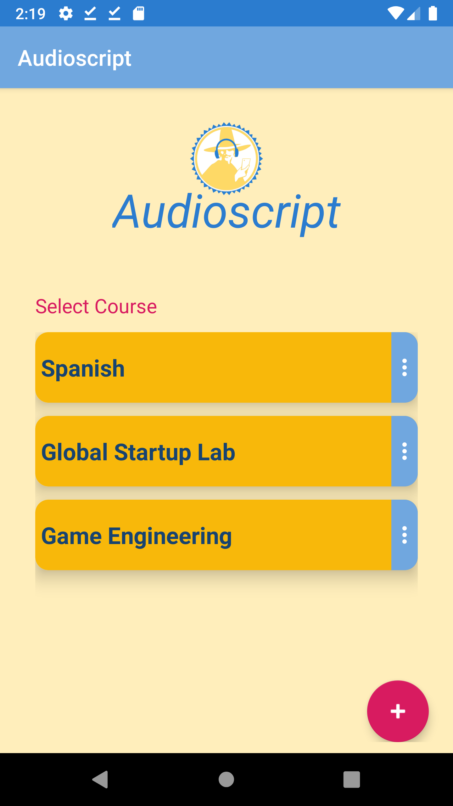
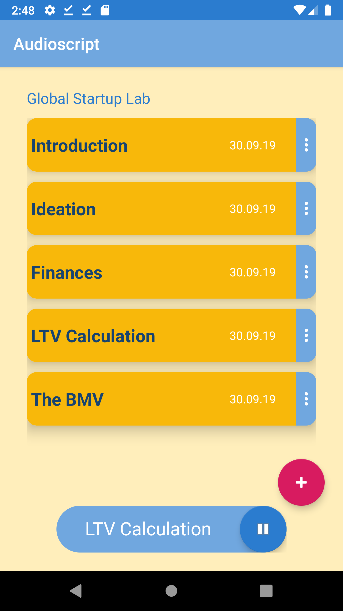

# Audioscript
 As part of the course "Global Startup Lab" at the University of Regensburg, an Android App was developed, that prepares study material (photos of physical docs or screenshots) as an audio book library. This allows students to study in situations, when their hands or eyes are busy (e.g. driving, showering, household).

# Technical Requirements
Android 4.3 or higher

# User Manual
In the main menu the user can select an existing course or add a new one by hitting the action button: /n

After a course was selected the user can play back the containing lessons or add a new file (from gallery or camera) to that course:

